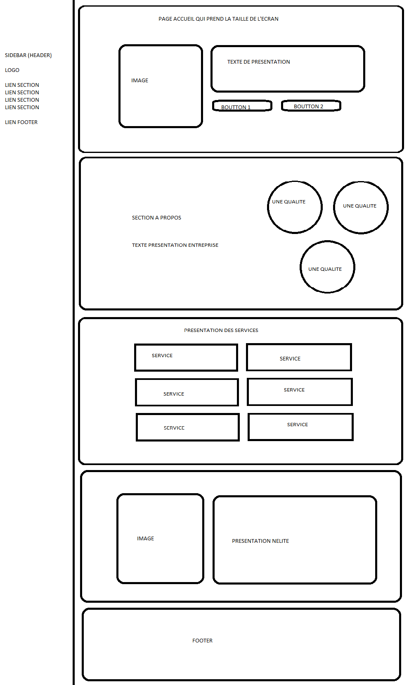

# s1-2021-ihm
# Livrable parties Économie et Documents numérique
[Rapport](doc/groupe_KORBI_TAGUIA_VAILLON_PAULIN.pdf)

Notre groupe est composé de MAXENCE PAULIN, SOFIANE VAILLON, AYOUB TAGUIA et du référent ARGJENTIN KORBI. 

Nous avons choisi l'entreprise Exakis Nelite

# écran de zoning :

Nous avons choisi cet affichage car il est facile avec les flexbox de la réaliser. 
Ceci explique en grande partie notre choix mais aussi la majorité des sites modernes utilisent ce genre d'affichage.
Argjentin s'est chargé de faire l'écran de zoning.

# écran prototype : 

# Auteurs des pages (sections)

Nous avons utilisé des sections afin que notre site tienne sur une seule page, ce qui rend la navigations beaucou plus aisé. 

Ainsi :
Argjentin s'est chargé de faire la page d'acceuil
Sofiance a réalisé la section à-propos
Ayoub s'est chargé de faire la section des services
Maxence a fait la dernière section qui présente la fusion de nelite et exakis

En ce qui concerne le menu et le pied de page, nous les avons fait en commun. 
Nous avons fait de même sur les couleurs présentes et l'aspect général du site. 

# Validation HTML W3C

# Validation CSS W3C

